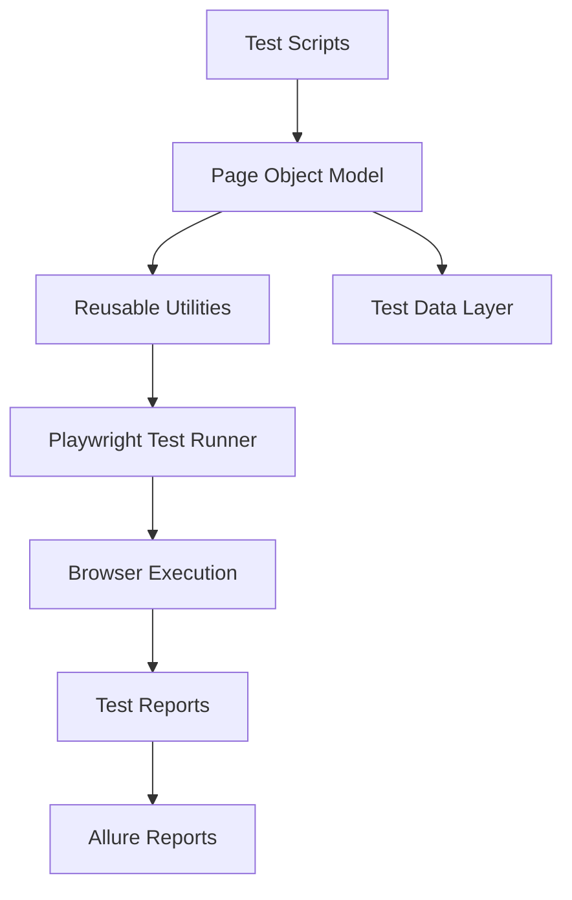
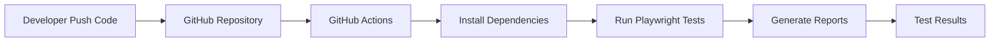

# 🚀 Playwright TypeScript Automation Framework


A **scalable end-to-end automation testing framework** built using
**Playwright + TypeScript** following modern test automation best practices.


# 📌 Project Overview

This repository demonstrates a **production-ready automation framework architecture** using **Playwright Test Runner** with **TypeScript**.

The framework is designed to support:

* Scalable automation architecture
* Cross-browser testing
* Reusable test utilities
* CI/CD pipeline integration
* Detailed reporting

This project serves as a **portfolio project showcasing modern automation engineering practices**.

---

# 🧰 Tech Stack

| Technology        | Purpose                   |
| ----------------- | ------------------------- |
| Playwright        | End-to-End UI Automation  |
| TypeScript        | Strongly typed scripting  |
| Node.js           | Runtime environment       |
| Allure            | Test reporting            |
| GitHub Actions    | Continuous Integration    |
| Page Object Model | Test architecture pattern |

---

# 🏗 Framework Architecture



The framework follows **clean architecture principles** where:

* Test logic is separated from page interactions
* Utilities are reusable across tests
* Data layer is externalized

---

# 📂 Project Structure

```
playwright-typescript-framework
│
├── .github/
│   └── workflows/
│       └── playwright.yml        # CI pipeline
│
├── pages/                        # Page Object Model classes
│   ├── LoginPage.ts
│   └── HomePage.ts
│
├── tests/                        # Test cases
│   ├── login.spec.ts
│   └── checkout.spec.ts
│
├── utils/                        # Utility/helper functions
│
├── testdata/                     # External test data
│
├── playwright.config.ts          # Playwright configuration
├── test.config.ts                # Framework configuration
│
├── package.json
├── tsconfig.json
├── .gitignore
└── README.md
```

---

# ✨ Key Features

✔ Page Object Model (POM)

✔ Modular framework architecture

✔ Cross-browser testing

✔ Test data separation

✔ Reusable utilities

✔ CI/CD automation support

✔ Rich HTML and Allure reporting

✔ Scalable test structure

---

# ⚙️ Installation

Clone the repository

```
git clone https://github.com/yourusername/playwright-typescript-framework.git
```

Navigate to project

```
cd playwright-typescript-framework
```

Install dependencies

```
npm install
```

Install Playwright browsers

```
npx playwright install
```

```
npm install dotenv
```

---

# ▶ Running Tests

Run all tests

```
npx playwright test
```

Run tests in headed mode

```
npx playwright test --headed
```

Run tests in specific browser

```
npx playwright test --project=chromium
```

Run specific test file

```
npx playwright test tests/login.spec.ts
```

---

# 📊 Test Reporting

The framework supports **Allure reporting**.

Generate test results

```
npx playwright test
```

Generate report

```
allure generate ./allure-results --clean
```

Open report

```
allure open
```

---

# 📸 Sample Report Screenshots

### Playwright HTML Report


---

### Allure Report Dashboard


---

# 🔁 CI/CD Pipeline

Automation tests run automatically using **GitHub Actions**.

CI pipeline executes on:

* Push to main branch
* Pull Requests

Pipeline steps:

1️⃣ Install dependencies
2️⃣ Install Playwright browsers
3️⃣ Execute test suite
4️⃣ Generate reports

Example workflow:

```
.github/workflows/playwright.yml
```

---

# 🔄 CI Workflow Diagram



---

# 🧪 Example Test

```
test('Verify login functionality', async ({ page }) => {

  await page.goto('https://example.com')

  await page.fill('#username', 'testuser')
  await page.fill('#password', 'password')

  await page.click('#login')

  await expect(page).toHaveURL(/dashboard/)

})
```

---

# 🚀 Future Improvements

* Docker-based test execution
* API testing integration
* Visual testing
* Slack test notifications
* Test environment configuration
* Parallel test optimization

---

# 👨‍💻 Author

**Ankit Singh**

Automation Engineer | Playwright | TypeScript | Test Architecture

GitHub: [https://github.com/ankitsingh-exe](https://github.com/ankitsingh-exe)

---

# ⭐ Support

If you find this project useful, please **give it a star ⭐**

It helps the repository gain visibility and supports future improvements.
